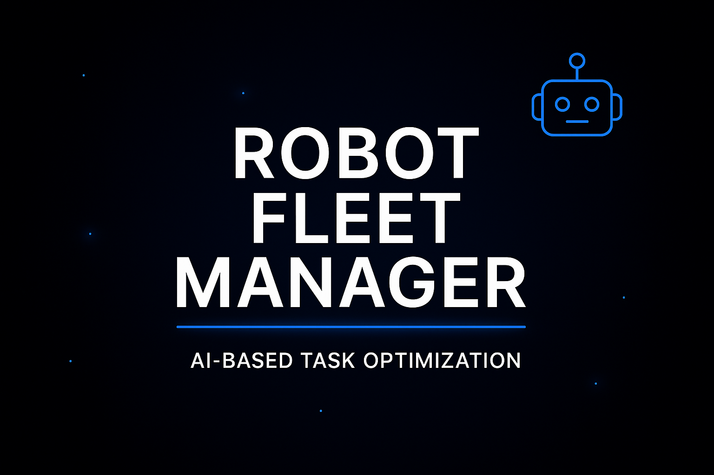

# Robot Fleet Manager (FastAPI + WebSocket)

A modular, real-time robot fleet management system built with **FastAPI**, **WebSockets**, and a lightweight **HTML/JS dashboard**.  
The system includes:

- A **Manager Server** (task assignment, reset, status tracking)
- Multiple **Robots** (workers connected via WebSocket)
- A **Dashboard** (real-time monitoring)

The architecture is fully modular: Manager, Robots, and Dashboard can run on **different machines**.

---

## 🚀 Features

- Real-time WebSocket communication  
- Secure API with API Key authentication  
- Robot status tracking (connected, idle, busy, resetting, disconnected)  
- Reset command with confirmation (`reset_done`)  
- Auto-reconnect for robots  
- Clean, modular folder structure  
- Independent run scripts for Manager and Robots  
- Dashboard with live updates  

---

## 📁 Project Structure
```
robot-fleet/
│
├── images/
│
├── manager/
│   ├── main.py
│   ├── config.py
│   └── init.py
│
├── robots/
│   ├── robot_base.py
│   ├── robot1.py
│   ├── robot2.py
│
├── dashboard.html
│
├── manager_run.bat
├── robot1_run.bat
├── robot2_run.bat
│
└── requirements.txt
```

---

## 🔧 Installation

Create and activate a virtual environment:
```
python -m venv venv
venv\Scripts\activate
```

Install dependencies:
```
pip install -r requirements.txt
```

---

## ▶️ Running the System

### 1) Start the Manager
```
manager_run.bat
```

Manager runs on:
```
http://127.0.0.1:8000
```

---

### 2) Start Robot 1
```
robot1_run.bat
```

### 3) Start Robot 2
```
robot2_run.bat
```

Robots automatically reconnect if Manager restarts.

---

### 4) Open the Dashboard

Just double‑click:
dashboard.html


Dashboard connects to Manager via WebSocket and updates in real time.

---

## 🔐 Authentication

All HTTP and WebSocket endpoints require an API key.

Example:
ws://127.0.0.1:8000/ws/robot?robot_id=robot_1&key=MY_SECRET_KEY_123

POST http://127.0.0.1:8000/reset?robot_id=robot_1&key=MY_SECRET_KEY_123


---

## 🧪 Testing with Postman

You can test all Manager API endpoints using Postman.

### 1) Assign a Task to a Robot

**POST**
```
http://127.0.0.1:8000/assign?robot_id=robot_1&key=MY_SECRET_KEY_123
```

**Body (JSON):**
```json
{
  "task": {
    "action": "move",
    "target": "A1"
  }
}
```
### 2) Reset a Robot

POST
```
http://127.0.0.1:8000/reset?robot_id=robot_1&key=MY_SECRET_KEY_123
```
No body required.

### 3) Get Status of All Robots

**GET**
```
http://127.0.0.1:8000/status?key=MY_SECRET_KEY_123
```

### 4) WebSocket Testing (Optional)

Postman also supports WebSocket testing.
Robot WebSocket
```
ws://127.0.0.1:8000/ws/robot?robot_id=robot_1&key=MY_SECRET_KEY_123
```

Dashboard WebSocket
```
ws://127.0.0.1:8000/ws/dashboard?key=MY_SECRET_KEY_123
```
You will receive real‑time JSON updates from the Manager.

---

## 🔄 Reset Workflow

1. Dashboard sends POST `/reset`  
2. Manager updates robot status → `resetting`  
3. Manager sends WebSocket command: `{ "command": "reset" }`  
4. Robot performs reset  
5. Robot sends back: `{ "event": "reset_done" }`  
6. Manager updates status → `idle`  
7. Dashboard updates automatically  

---

## 🧩 Architecture Overview

```
┌──────────────┐
│   Dashboard   │
│ (WebSocket)   │
└───────▲──────┘
│
│
┌─────────┴─────────┐
│     Manager        │
│  FastAPI + WS      │
└───────▲──────┬────┘
│       │
ws://robot1        ws://robot2
┌──────┴──────┐ ┌──────┴──────┐
│   Robot 1    │ │   Robot 2    │
│ (Python WS)  │ │ (Python WS)  │
└──────────────┘ └──────────────┘
```


---

## 📝 Notes

- Robots and Manager can run on **different machines**  
- Dashboard can run from **any device** (PC, laptop, mobile)  
- System is fully modular and deployment‑friendly  

---

## 📌 Future Improvements

- Docker support  
- JWT authentication  
- Log viewer in Dashboard  
- Task queue and scheduling  
- Multi‑robot task distribution  

---

## 📄 License

MIT License

